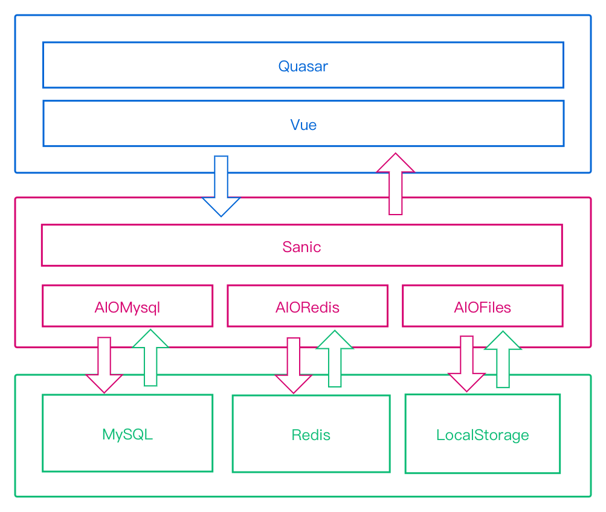

# 开发文档

## 需求分析

### 系统目标

本项目旨在建立一个用于管理视频、字幕以及轻小说资源的系统。

所需功能主要包含三个方面：

1. **整理资源**

    待整理的资源包括英配动画、cc字幕（包括已经加工和未加工以及正在加工）、压制完成的英配动画、英配轻小说。对于每类资源需能分别记录对应的必要信息，如英配动画的季数、中文名、英文名、罗马音名，以及动画类型，原著作者等等。

2. **资源检索与分享**

    提供多种资源检索方式，如关键字、标签、过滤器等等。同时为已经被收录的资源提供良好的展示页面。

3. **提供编程接口**

    提供必要的编程接口供其他系统使用。如查询收录资源的统计信息，或者各类资源的具体信息等等。

### 具体功能

1. **信息管理**

    信息录入功能应包括：自动导入如[anidb.net](https://anidb.net/)、[bangumi.tv](https://bangumi.tv/)、[reelgood.com](https://reelgood.com/)等数据库的信息，以及手动录入信息。同时为已经录入的信息提供编辑与删除等功能。

2. **信息检索**

    这也是这个数据库的核心功能，可以根据已知的信息查询想要的信息。例如：根据一个番剧名（英文名、罗马音名、中文名、日文名等）查询出这个番的其他信息。或者查询这个数据库的某些信息，集数最多的番是哪部、2020年上架的番有哪些、搞笑的番有哪些、参与制作字幕最多人是谁（肯定是子弹啦，Ahhh）类似这种功能。

3. **用户管理**

    设置不同用户权限，有的可以修改，有的只能查询，这类功能。

4. **日志记录**

    记录数据库修改信息，方便纠错。

5. **生成报表**

    能够输出年度总结

## 系统设计

### 总体架构


<div align=center></div>


### Model

#### 设计准则

将可变的同类型字段（如各种语言的名字，各种语言的简介，文件的元信息）使用json存储。

所有的字符串类型不可为null，默认值为空字符串。

枚举值使用字符串类型，具体值域另行记录

#### ip

* **Column:**

    | Filed                        | Type           | Nullable | Comment      |
    | ---------------------------- | -------------- | -------- | ------------ |
    | id                           | integer        | PK       |              |
    | name                         | varchar(300)   | False    | 标识名       |
    | reserved_names               | json           | False    | 别名         |
    | [ reserved_names.jp_name ]   | json.attr: str | Optional | 日文名       |
    | [ reserved_names.cn_name ]   | json.attr: str | Optional | 中文名       |
    | [ reserved_names.en_name ]   | json.attr: str | Optional | 英文名       |
    | [ reserved_names.rm_name ]   | json.attr: str | Optional | 罗马音名     |
    | [ reserved_names.misc_name ] | json.attr: str | Optional | 混合关键字   |
    | region                       | varchar(300)   | False    | 地区         |
    | written_by                   | varchar(300)   | False    | 原著作者     |
    |                              |                |          |              |
    | created_by                   | integer        | False    | 创建者       |
    | created_at                   | datetime       | False    | 创建日期     |
    | updated_by                   | integer        | False    | 最近编辑者   |
    | updated_at                   | datetime       | False    | 最近编辑日期 |
    | comment                      | varchar(300)   | False    | 备注         |
    
* **Foreign Key Constraint:**

    * (created_by, user.id, ondelete='SET NULL', onupdate='CASCADE')
    * (created_by, user.id, ondelete='SET NULL', onupdate='CASCADE')

* **Index**:

    - (name, unique=True)

#### animation

* **Column:**

    | Filed                             | Type            | Nullable  | Comment             |
    | --------------------------------- | --------------- | --------- | ------------------- |
    | id                                | integer         | PK        |                     |
    | ip_id                             | integer         | False     | 所属ip的id          |
    | name                              | varchar(300)    | False     | 标识名              |
    | reserved_names                    | json            | False     | 别名                |
    | [ reserved_names.jp_name ]        | json.attr: str  | Optional  | 日文名              |
    | [ reserved_names.cn_name ]        | json.attr: str  | Optional  | 中文名              |
    | [ reserved_names.en_name ]        | json.attr: str  | Optional  | 英文名              |
    | [ reserved_names.rm_name ]        | json.attr: str  | Optional  | 罗马音名            |
    | [ reserved_names.misc_name ]      | json.attr: str  | Optional  | 混合关键词          |
    | intros                            | json            | False     | 简介                |
    | [ en_intro ]                      | json.attr: str  | Optional  | 中文简介            |
    | [ cn_intro ]                      | json.attr: str  | Optional  | 英文简介            |
    | image_ids                         | json            | False     | 展示图id            |
    | [ image_ids.horizontal_image_id ] | json.attr: int  | Necessary | 横向图id            |
    | [ image_ids.vertical_image_id ]   | json.attr: int  | Necessary | 竖向图id            |
    | produced_by                       | varchar(300)    | False     | 出品公司            |
    | released_at                       | datetime        | False     | 上映时间            |
    | type                              | varchar(300)    | False     | TV/movie/SP/OVA/OAD |
    | episodes_num                      | integer         | False     | 集数                |
   | sharing_address                     | json           | False     | 分享地址     |
   | [ sharing_addresses.baidu.url ]     | json.attr: str | Necessary |              |
   | [ sharing_addresses.baidu.password] | json.attr: str | Optional  |              |
   | [ sharing_addresses.ali.url ]       | json.attr: str | Necessary |              |
   | [ sharing_addresses.ali.password]   | json.attr: str | Optional  |              |
   
* **Enum:**

    - type: (TV, MOVIE, SP, OVA, OAD)

* **Foreign Key Constraint:**

    * (ip_id, ip.id, ondelete='CASCADE', onupdate='CASCADE')

#### video


* **Column:**

    | Filed                 | Type           | Nullable | Comment           |
    | --------------------- | -------------- | -------- | ----------------- |
    | id                    | integer        | PK       |                   |
    | animation_id          | integer        | False    |                   |
    | file_meta             | json           | False    | 视频元信息        |
    | [ file_meta.name ]    | json.attr: str | Optional | 文件原名          |
    | [ file_meta.type ]    | json.attr: str | Optional | 格式（mp4/        |
    | [ file_meta.size ]    | json.attr: int | Optional | 视频大小          |
    | [ file_meta.quality ] | json.attr: str | Optional | 分辨率（720/原画/ |
    
* **Enum:**

    - file_meta.format: (MP4, MKV, AV1, OGG)
    - file_meta.quality: (360P, 640P, 720P, 960P, 1080P)

* **Foreign Key Constraint:**

    * (animation_id, animation.id, ondelete='CASCADE', onupdate='CASCADE')

#### caption


* **Column:**

    | Filed        | Type | Nullable | Comment         |
    | ------------ | ---- | -------- | --------------- |
    | id       | integer | PK |                 |
    | animation_id | integer | False | 所属animation的id |
    | integrated | bool | False | 完整1，不完整0 |
    | state | varchar(300) | False | doing/todo/done |
    | released_at | datetime | True | 完成于     |
    | file_meta    | json  | False | 文件元信息 |
    | [ file_meta.name ] | json.attr: str | Optional | 文件原名       |
    | [ file_meta.type ] | json.attr: str | Optional | 格式/txt/pdf   |
    | [ file_meta.size ] | json.attr: int | Optional | 文件大小       |
    
* **Enum:**

    - state: (TODO, DOING, DONE)

    - file_meta.format: (SRT, ASS, VTT, SUP, SSA)

* **Foreign Key Constraint:**

    * (animation_id, animation.id, ondelete='CASCADE', onupdate='CASCADE')


#### novel


* **Column:**

    | Filed                               | Type           | Nullable  | Comment      |
    | ----------------------------------- | -------------- | --------- | ------------ |
    | id                                  | integer        | PK        |              |
    | ip_id                               | integer        | False     | 参照ip的id   |
    | name                                | varchar(300)   | False     | 标识名       |
    | reserved_names                      | json           | False     | 别名         |
    | [ reserved_names.jp_name ]          | json.attr: str | Optional  | 日文名       |
    | [ reserved_names.cn_name ]          | json.attr: str | Optional  | 中文名       |
    | [ reserved_names.en_name ]          | json.attr: str | Optional  | 英文名       |
    | [ reserved_names.rm_name ]          | json.attr: str | Optional  | 罗马音名     |
    | [ reserved_names.misc_name ]        | json.attr: str | Optional  | 混合关键字   |
    | intros                              | json           | False     | 简介         |
    | [ intro.cn_intro ]                  | json.attr: str | Optional  | 中文简介     |
    | [ intro.en_intro ]                  | json.attr: str | Optional  | 英文简介     |
    | image_ids                           | json           | True      |              |
    | [ image_ids.horizontal_image_id ]   | json.attr: int | Necessary | 横向图id     |
    | [ image_ids.vertical_image_id ]     | json.attr: int | Necessary | 竖向图id     |
    | volumes_num                         | integer        | False     | 卷数         |
    | integrated                          | bool           | False     | 完整性       |
    | file_meta                           | json           | False     | 文件元信息   |
   | [ file_meta.name ]                  | json.attr: str | Optional  | 文件原名     |
   | [ file_meta.type ]                  | json.attr: str | Optional  | 格式/txt/pdf |
   | [ file_meta.size ]                  | json.attr: int | Optional  | 文件大小     |
   | sharing_address                     | json           | False     | 分享地址     |
   | [ sharing_addresses.baidu.url ]     | json.attr: str | Necessary |              |
   | [ sharing_addresses.baidu.password] | json.attr: str | Optional  |              |
   | [ sharing_addresses.ali.url ]       | json.attr: str | Necessary |              |
   | [ sharing_addresses.ali.password]   | json.attr: str | Optional  |              |
   
* **Enum:**

    - file_meta.format: (TXT, PDF, EPUB)

* **Foreign Key Constraint**:

    * (ip_id, ip.id, ondelete='CASCADE', onupdate='CASCADE')


#### file


* **Column:**

    | Filed  | Type | Nullable | Comment            |
    | ------ | ---- | -------- | ------------------ |
    | id | integer | PK |                    |
    | region | varchar(300) | False | 区域（本地/oss |
    | bucket | varchar(300) | False | 文件桶         |
    | path | varchar(300) | False | 具体路径，包括名字 |
    | file_meta | json | False | 文件信息       |
    | [ file_meta.name ] | json.attr: str | Optional | 文件名 |
    | [ file_meta.type ] | json.attr: str | Optional | 文件类型 |
    | [ file_meta.size ] | json.attr: int | Optional | 文件大小 |

#### tag


* **Column:**

    | Filed                      | Type           | Nullable | Comment |
    | -------------------------- | -------------- | -------- | ------- |
    | id                         | integer        | PK       |         |
    | name                       | varchar(300)   | False    |         |
    | reserved_names             | json           | False    | 别名    |
    | [ reserved_names.cn_name ] | json.attr: str | Optional | 中文名  |
    | [ reserved_names.en_name ] | json.attr: str | Optional | 英文名  |

#### ip_tag


* **Column:**

    | Filed  | Type    | Nullable | Comment |
    | ------ | ------- | -------- | ------- |
    | id     | integer | PK       |         |
    | ip_id  | integer | False    |         |
    | tag_id | integer | False    |         |

#### user


* **Column:**

    | Filed         | Type    | Nullable | Comment |
    | ------------- | ------- | -------- | ------- |
    | id        | integer | PK |         |
    | name      | varchar(300) | False |         |
    | password  | char(64) | False |         |
    | salt      | char(64) | False |         |
    | email     | varchar(300) | False |         |
    | mobile    | varchar(300) | False |         |
    | intro     | varchar(300) | False |         |
    | avatar_id | integer | True |         |
    |            |      |          |          |
    | created_at          | datetime | False | 创建日期     |
    | comment             | varchar(300) | False | 备注         |

#### caption_user


* **Column:**

    | Filed      | Type   | Nullable | Comment |
    | ---------- | ------ | -------- | ------- |
    | id         | intger | PK       |         |
    | caption_id | intger | False    |         |
    | user_id    | intger | False    |         |

#### role


* **Column:**

    | Filed                      | Type           | Nullable | Comment      |
    | -------------------------- | -------------- | -------- | ------------ |
    | id                         | intger         | PK       |              |
    | name                       | varchar(300)   | False    | 角色名       |
    | reserved_names             | json           | False    | 别名         |
    | [ reserved_names.cn_name ] | json.attr: str | Optional | 中文名       |
    | [ reserved_names.en_name ] | json.attr: str | Optional | 英文名       |
    | style                      | json           | False    | 样式         |
    | [ style.icon ]             | json.attr: str | Optional | 角色徽章图标 |
    | [ style.color ]            | json.attr: str | Optional | 角色徽章颜色 |
    |                            |                |          |              |
    | created_at                 | date           | False    | 创建日期     |
    | comment                    | varchar(300)   | False    | 备注         |
#### user_role


* **Column:**

    | Filed   | Type   | Nullable | Comment |
    | ------- | ------ | -------- | ------- |
    | id      | intger | PK       |         |
    | user_id | intger | False    |         |
    | role_id | intger | False    |         |


### Service

#### 设计准则

删除操作不返回任何数据，其他操作返回操作后的数据对象。

大范围使用了可变关键字参数，且对传入的数据只有最基础的非空校验。

#### ip

* 新增、更新、删除 ip 对象
* 按 id 查询单个 ip 对象、按 id 列表查询多个 ip 对象
* 按 limit、offset 顺序列出 ip 对象

#### animation

-   新增、更新、删除 animation 对象
-   按 id 查询单个 animation 对象、按 id 列表查询多个 animation 对象
-   按 limit、offset、ip_id 顺序列出 animation 对象

#### video

-   新增、更新、删除 video 对象
-   按 id 查询单个 video 对象、按 id 列表查询多个 video 对象
-   按 limit、offset、animation_id 顺序列出 video 对象

#### caption

-   新增、更新、删除 video 对象
-   按 id 查询单个 caption 对象、按 id 列表查询多个 caption 对象
-   按 limit、offset、animation_id 顺序列出 caption 对象

#### novel

-   新增、更新、删除 novel 对象
-   按 id 查询单个 novel 对象、按 id 列表查询多个 novel 对象
-   按 limit、offset、ip_id 顺序列出 novel 对象

#### tag

-   新增、更新、删除 tag 对象
-   按 id 查询单个 tag 对象、按 id 列表查询多个 tag 对象
-   按 limit、offset 顺序列出 tag 对象

#### ip_tag

-   新增、删除 ip_tag 关系
-   按 limit、offset、ip_id 顺序列出 ip_tag 对象
-   按 limit、offset、tag_id 顺序列出 ip_tag 对象

#### user

-   新增、更新、删除 user 对象
-   按 id 查询单个 user 对象、按 id 列表查询多个 user 对象
-   按 mobile、email 查询单个 user 对象
-   按 limit、offset 顺序列出所有 user 对象
-   按 id 设置、取消 user 对象的 staff 角色
-   按 id 或 id 列表来判断单个 user 或多个 user 对象是否拥有 staff 角色

#### caption_user

-   新增、删除 caption_user 关系
-   按 limit、offset、caption_id 顺序列出 caption_user 对象
-   按 limit、offset、user_id 顺序列出 caption_user 对象


### API

#### 设计准则

对用户传入的数据进行如下处理：

-   格式检验
-   必要参数是否为空

编辑对象时，如果编辑的字段未知，则需要sift_dict_by_key。若编辑的字段已知(如创建时)，则逐一填写。

#### account

-   account/login


### 存储方案

```
api_data
├── logs
│   ├── access.log
│   └── app.log
├── region: (local,remote,...)
│  └── buckets: (limbo,user,animation,novel,...)
│       └── path: (user.id,animation.id,...)
│           └── file: (random_string16.ext)
├── region
│  └── ...
...
```


## 系统测试
