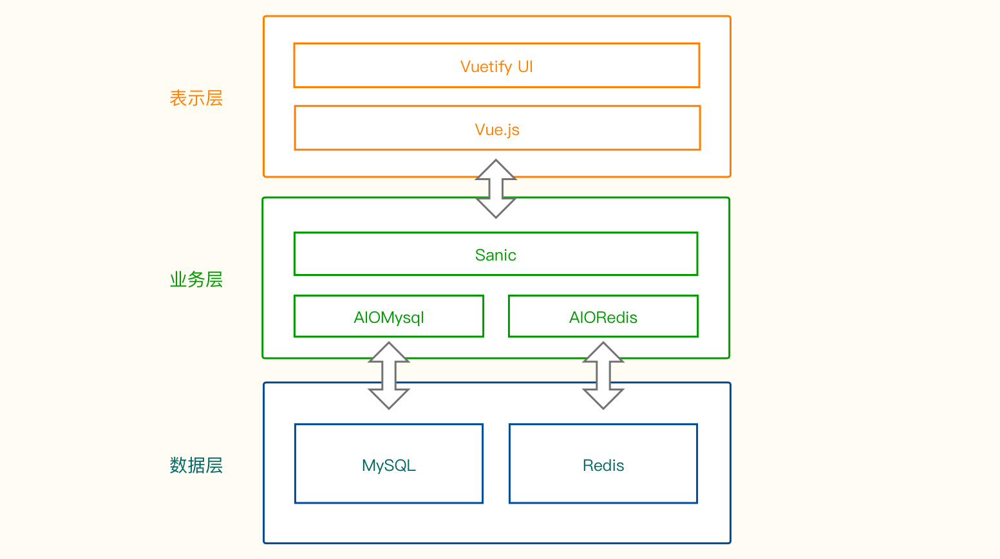

# 开发文档

## 需求分析

### 系统目标

本项目旨在建立一个用于管理视频、字幕以及轻小说资源的系统。

系统功能主要包含三个方面：

1. **整理资源**

    目前部落拥有的资源包括，英配动画、未加工的CC字幕、已加工的CC字幕、已压制的英配动画、英配轻小说。目前这些资源都是分别整理记录。并且单英配动画的信息就有很多，比如季数、中文名、英文名、罗马音名、剧场版等。之前资源少时，下载资源时就是无脑下载，因为大多数动画都没有收录。但现在以及收录的动画超过了800部，资源网上发布新资源时很难分辨这个番是否已经收录。需要根据罗马音名或英文名搜中文名，然后再与已有资源对比然后再确认下载，这个过程已经严重拖慢了效率。如果将已有的资源建立一个数据库，里面包含需要的信息，这些信息可以去网上爬下来。这样有新资源时就很快知道是否已经收录，而且资源网站还有RSS功能，也可以实现有新资源时自动提示下载，或者再进一步实现自动下载。

2. **分享资源**

    目前部落分享资源主要通过 list.edatribe.com 网址分享资源，这就是一个静态网页，里面的信息很少，而且需要手动更新。如果连接此数据库就可以自动更新信息，而且可以显示更多信息，包括大小，集数，视频质量等等。下载资源的体验会更好。

3. **网站调用**

    目前网站更新动画时，动画信息都是手工录入，如果能和此数据库连接，就可以直接调用数据库里的信息，减少工作量。

此数据库主要是一个后端程序，通过API可以让不同程序调用。其实本质上有些类似学生管理系统或者图书馆管理系统。

### 具体功能

1. **信息录入功能**

    当有新资源时需要录入到数据库，有些信息需要手工操作，有些信息可以直接爬其他网站。比如：https://anidb.net/（英文数据库）、https://bangumi.tv/（中文数据库）https://reelgood.com/。录入时可以调用爬取的资源，如果信息不对也可以手动修改。

2. **信息查询功能**

    这也是这个数据库的核心功能，可以根据已知的信息查询想要的信息。例如：根据一个番剧名（英文名、罗马音名、中文名、日文名等）查询出这个番的其他信息。或者查询这个数据库的某些信息，集数最多的番是哪部、2020年上架的番有哪些、搞笑的番有哪些、参与制作字幕最多人是谁（肯定是子弹啦，Ahhh）类似这种功能。

3. **用户权限管理**

    设置不同用户权限，有的可以修改，有的只能查询，这类功能。

4. **日志功能**

    记录数据库修改信息，方便纠错。

5. **报表功能**

    能够输出年度总结

## 系统设计

### 技术架构

### 数据模型

#### 设计准则

将可变的同类型字段（如各种语言的名字，各种语言的简介，文件的元信息）使用json存储。

所有的字符串类型不可为null，默认值为空字符串。

枚举值使用字符串类型，具体值域另行记录

#### 逻辑层设计

* **Table Name: ip**

    **Column:**

    | Filed                        | Type           | Nullable | Comment      |
    | ---------------------------- | -------------- | -------- | ------------ |
    | id                           | integer        | PK       |              |
    | name                         | varchar(300)   | False    | 标识名       |
    | reserved_names               | json           | True     | 别名         |
    | [ reserved_names.jp_name ]   | json.attr: str | Optional | 日文名       |
    | [ reserved_names.cn_name ]   | json.attr: str | Optional | 中文名       |
    | [ reserved_names.en_name ]   | json.attr: str | Optional | 英文名       |
    | [ reserved_names.rm_name ]   | json.attr: str | Optional | 罗马音名     |
    | [ reserved_names.misc_name ] | json.attr: str | Optional | 混合关键字   |
    | intros                       | json           | True     | 简介         |
    | [ intro.cn_intro ]           | json.attr: str | Optional | 中文简介     |
    | [ intro.en_intro ]           | json.attr: str | Optional | 英文简介     |
    |                              |                |          |              |
    | created_by                   | integer        | False    | 创建者       |
    | created_at                   | datetime       | False    | 创建日期     |
    | updated_by                   | integer        | False    | 最近编辑者   |
    | updated_at                   | datetime       | False    | 最近编辑日期 |
    | comment                      | varchar(300)   | False    | 备注         |

    **Foreign Key Constraint:**

    * (created_by , user.id, ondelete='SET NULL', onupdate='CASCADE')
    * (created_by , user.id, ondelete='SET NULL', onupdate='CASCADE')

    **Index**:

    - (name, unique=True)

* **Table Name: animation**

    **Column:**
    
    | Filed               | Type | Nullable | Comment             |
    | ------------------- | ---- | -------- | ------------------- |
    | id              | integer | PK |                     |
    | ip_id           | integer | False | 所属ip的id |
    | name            | varchar(300) | False | 标识名         |
    | reserved_names | json | True | 别名 |
    | [ reserved_names.jp_name ] | json.attr: str | Optional | 日文名             |
    | [ reserved_names.cn_name ] | json.attr: str | Optional | 中文名             |
    | [ reserved_names.en_name ] | json.attr: str | Optional | 英文名             |
    | [ reserved_names.rm_name ] | json.attr: str | Optional | 罗马音名           |
    | [ reserved_names.misc_name ] | json.attr: str | Optional | 混合关键词 |
    | intros | json | True | 简介 |
    | [ en_intro ]        | json.attr: str | Optional | 中文简介            |
    | [ cn_intro ]        | json.attr: str | Optional | 英文简介            |
    | image_ids | json | True | 展示图id |
    | [ image_ids.horizontal_image_id ] | json.attr: int | Necessary | 横向图id       |
    | [ image_ids.vertical_image_id ] | json.attr: int | Necessary | 竖向图id |
    | [ image_ids.reversed_image_id ] | json.attr: int | Optional | 备用图id |
    | produced_by | varchar(300) | False | 出品公司       |
    | released_at | datetime | False | 上映时间 |
    | written_by      | varchar(300) | False | 原著作者       |
    | type            | varchar(300) | False | TV/movie/SP/OVA/OAD |
    | episodes_num    | integer | False | 集数            |
    
    **Enum:**
    
    - type: (TV, MOVIE, SP, OVA, OAD)
    
    **Foreign Key Constraint:**
    
    * (ip_id , ip.id, ondelete='CASCADE', onupdate='CASCADE')

* **Table Name: video**

    **Column:**
    
    | Filed                 | Type           | Nullable | Comment           |
    | --------------------- | -------------- | -------- | ----------------- |
    | id                    | integer        | PK       |                   |
    | animation_id          | integer        | False    |                   |
    | file_url              | varchar(300)   | False    | 视频链接          |
    | file_meta             | json           | False    | 视频元信息        |
    | [ file_meta.size ]    | json.attr: int | Optional | 视频大小          |
    | [ file_meta.quality ] | json.attr: str | Optional | 分辨率（720/原画/ |
    | [ file_meta.format ]  | json.attr: str | Optional | 格式（mp4/        |
    
    **Enum:**
    
    - file_meta.quality: (720P, 1080P)
    - file_meta.format: (MP4,)
    
    **Foreign Key Constraint:**
    
    * (animation_id , animation.id, ondelete='CASCADE', onupdate='CASCADE')

* **Table Name: caption**

    **Column:**
    
    | Filed        | Type | Nullable | Comment         |
    | ------------ | ---- | -------- | --------------- |
    | id       | integer | PK |                 |
    | animation_id | integer | False | 所属animation的id |
    | integrated | bool | False | 完整1，不完整0 |
    | status   | varchar(300) | False | doing/todo/done |
    | finished_at | datetime | True | 完成于     |
    | file_url | varchar(300) | False | 字幕文件链接 |
    | file_meta    | json  | True | 文件元信息 |
    | [ file_meta.name ] | json.attr: str | Optional | 文件原名       |
    | [ file_meta.format ] | json.attr: str | Optional | 格式/txt/pdf   |
    | [ file_meta.size ] | json.attr: int | Optional | 文件大小       |
    
    **Enum:**
    
    - status: (todo, doing, done)
    
    - file_meta.format: (SRT,)
    
    **Foreign Key Constraint:**
    
    * (animation_id , animation.id, ondelete='CASCADE', onupdate='CASCADE')
    
* **Table Name: novel**

    **Column:**
    
    | Filed            | Type      | Nullable | Comment        |
    | ---------------- | --------- | -------- | -------------- |
    | id           | integer | PK |                |
    | ip_id        | integer | False | 参照ip的id |
    | name                | varchar(300) | False | 标识名   |
    | reserved_names | json  | True | 别名     |
    | [ reserved_names.jp_name ] | json.attr: str | Optional | 日文名       |
    | [ reserved_names.cn_name ] | json.attr: str | Optional | 中文名       |
    | [ reserved_names.en_name ] | json.attr: str | Optional | 英文名       |
    | [ reserved_names.rm_name ] | json.attr: str | Optional | 罗马音名     |
    | [ reserved_names.misc_name ] | json.attr: str | Optional | 混合关键字   |
    | intros              | json  | True | 简介     |
    | [ intro.cn_intro ]    | json.attr: str | Optional | 中文简介     |
    | [ intro.en_intro ]    | json.attr: str | Optional | 英文简介     |
    | image_ids | json | True |  |
    | [ image_ids.horizontal_image_id ] | json.attr: int | Necessary | 横向图id       |
    | [ image_ids.vertical_image_id ] | json.attr: int | Necessary | 竖向图id |
    | [ image_ids.reversed_image_id ] | json.attr: int | Optional | 备用图id |
    | written_by   | varchar(300) | False | 作者       |
    | volumes_num  | integer | False | 卷数       |
    | integrated | bool | False | 完整性 |
    | file_url     | varchar(300) | False | 文件链接   |
    | file_meta    | json  | True | 文件元信息 |
    | [ file_meta.name ] | json.attr: str | Optional | 文件原名       |
    | [ file_meta.format ] | json.attr: str | Optional | 格式/txt/pdf   |
    | [ file_meta.size ] | json.attr: int | Optional | 文件大小       |
    
    **Enum:**
    
    - file_meta.format: (TXT, PDF)
    
    **Foreign Key Constraint**:
    
    * (ip_id , ip.id, ondelete='CASCADE', onupdate='CASCADE')
    
* **Table Name: file**

    **Column:**

    | Filed  | Type | Nullable | Comment            |
    | ------ | ---- | -------- | ------------------ |
    | id | integer | PK |                    |
    | region | varchar(300) | False | 区域（本地/oss |
    | bucket | varchar(300) | False | 文件桶         |
    | path | varchar(300) | False | 具体路径，包括名字 |
    | file_meta | json | True | 文件信息       |
    | [ file_meta.name ] | json.attr: str | Optional | 文件名 |
    | [ file_meta.type ] | json.attr: str | Optional | 文件类型 |
    | [ file_meta.size ] | json.attr: int | Optional | 文件大小 |
    
* **Table Name: tag**

    **Column:**

    | Filed | Type         | Nullable | Comment |
    | ----- | ------------ | -------- | ------- |
    | id    | integer      | PK       |         |
    | name  | varchar(300) | False    |         |

* **Table Name: ip_tag**

    **Column:**

    | Filed  | Type    | Nullable | Comment |
    | ------ | ------- | -------- | ------- |
    | id     | integer | PK       |         |
    | ip_id  | integer | False    |         |
    | tag_id | integer | False    |         |

* **Table Name: user**

    **Column:**

    | Filed         | Type    | Nullable | Comment |
    | ------------- | ------- | -------- | ------- |
    | id        | integer | PK |         |
    | name      | varchar(300) | False |         |
    | password  | char(64) | False |         |
    | salt      | char(64) | False |         |
    | email     | varchar(300) | False |         |
    | mobile    | varchar(300) | False |         |
    | intro     | varchar(300) | False |         |
    | avatar_id | integer | True |         |
    |            |      |          |          |
    | created_at          | datetime | False | 创建日期     |
    | comment             | varchar(300) | False | 备注         |
    
* **Table Name: caption_user**

    **Column:**

    | Filed      | Type   | Nullable | Comment |
    | ---------- | ------ | -------- | ------- |
    | id         | intger | PK       |         |
    | caption_id | intger | False    |         |
    | user_id    | intger | False    |         |

* **Table Name: staff**

    **Column:**

    | Filed       | Type    | Nullable | Comment |
    | ----------- | ------- | -------- | ------- |
    | id      | intger | PK |         |
    | user_id | intger | False |         |
    |            |      |          |          |
    | created_at          | date  | False | 创建日期     |
    | comment             | varchar(300) | False | 备注         |
    
      

### 业务功能

* **ip**
    * 新增、更新、删除 ip 对象
    * 按 id 查询单个 ip 对象、按 id 列表查询多个 ip 对象
    * 按 limit、offset 顺序列出 ip 对象
* **animation**
    * 新增、更新、删除 animation 对象
    * 按 id 查询单个 animation 对象、按 id 列表查询多个 animation 对象
    * 按 limit、offset、ip_id 顺序列出 animation 对象
* **video**
    * 新增、更新、删除 video 对象
    * 按 id 查询单个 video 对象、按 id 列表查询多个 video 对象
    * 按 limit、offset、animation_id 顺序列出 video 对象
* **caption**
    * 新增、更新、删除 video 对象
    * 按 id 查询单个 caption 对象、按 id 列表查询多个 caption 对象
    * 按 limit、offset、animation_id 顺序列出 caption 对象
* **novel**
    * 新增、更新、删除 novel 对象
    * 按 id 查询单个 novel 对象、按 id 列表查询多个 novel 对象
    * 按 limit、offset、ip_id 顺序列出 novel 对象
* **tag**
    * 新增、更新、删除 tag 对象
* **ip_tag**
    * 新增、删除 ip_tag 关系
    * 按 ip_id 生成 tag_id 列表
    * 按 tag_id 生成 ip_id 列表
* **user**
    * 新增、更新、删除 user 对象
    * 按 id 查询单个 user 对象、按 id 列表查询多个 user 对象
    * 按 mobile、email 查询单个 user 对象
    * 按 limit、offset 顺序列出所有 user 对象
    * 按 id 设置、取消 user 对象的 staff 角色
    * 按 id 或 id 列表来判断单个 user 或多个 user 对象是否拥有 staff 角色
* **caption_user**
    * 新增、删除 caption_user 关系
    * 按 caption_id 生成 user_id 列表
    * 按 user_id 生成 user_id 列表

### API 端点

## TODO

- [x] 实现模型
- [x] 重构开发文档
- [x] 规范类型值域
- [x] 检查是否可空
- [x] 检查外键约束以及修改时的行为
- [ ] 设计索引
- [ ] 规范表comment
- [ ] 规范枚举值
- [ ] 实现业务逻辑
- [ ] 设计api端点

